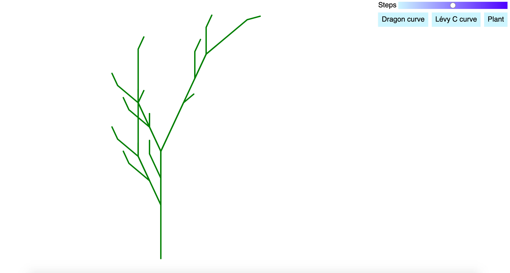
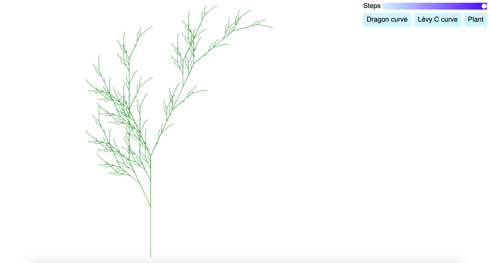

# l-systems

A simple implementation of [L-systems](https://en.wikipedia.org/wiki/L-system) in Elm. Demo [here](https://o-o-balance.github.io/).

The demo allows the user to select one of three different L-systems to render. A slider controls the number of iterations generated.

## Packages used
* [elm-geometry](https://package.elm-lang.org/packages/ianmackenzie/elm-geometry/latest/) to represent the fractals
* [elm-geometry-svg](https://package.elm-lang.org/packages/ianmackenzie/elm-geometry-svg/latest/) for rendering to SVG
* [elm-ui](https://package.elm-lang.org/packages/mdgriffith/elm-ui/latest/) for the user interface of the demo

## What's next?
* Expand UI to enable editing the rules to generate the fractal
* Asynchronous rendering
* 3D L-systems
